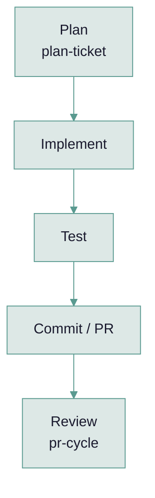

# dev-workflow Plugin

Standalone, all-in-one ticket-to-PR development workflow. One install gives you the full
`plan → implement → test → commit/PR → review` cycle with approval checkpoints, plus every
skill it orchestrates, bundled in a single plugin — no separate installs required.

Built for day-to-day ticket work: you already have a Jira ticket, you want a quick plan and a
reviewed PR. It does not write specs or design docs — for that, upfront-planning heavier work,
see [`sdd`](../sdd/README.md).

## How it flows



`workflow` is the orchestrator that walks these phases with approval checkpoints; each phase
can also be run standalone via its own skill.

## Compatibility

| Field | Value |
|-------|-------|
| **Format** | `claude-plugin` |
| **Works with** | `claude-code` |
| **Scope** | Development |
| **Author** | Rhonalf Martinez |

## Skills

| Skill | Description |
|-------|--------------|
| `/dev-workflow:workflow` | The orchestrator — detects stack, loads project rules, walks phases 1-6 with checkpoints |
| `/dev-workflow:plan-ticket <ID>` | Reads a Jira ticket, explores the codebase, writes an implementation plan |
| `/dev-workflow:pr-cycle <PR> [TICKET] [suite]` | Full PR review — detects the stack automatically (Rails, Next.js, PHP Yii2, WordPress, Shopify) |
| `/dev-workflow:frontend-quality-rules` | React/JSX + CSS code quality rules, applied automatically for frontend JS stacks |
| `/dev-workflow:generate-agent-rules` | Turns this plugin's `pr-cycle` rules into `docs/agent-rules/<stack>.md` + a pointer in `CLAUDE.md`/`AGENTS.md` |

## Works well with

| Plugin | Why |
|--------|-----|
| [`answer-to-copilot`](../answer-to-copilot/README.md) | Used in Phase 5 of the `workflow` skill to triage Copilot PR comments, if that separate plugin happens to be installed too. Not bundled here. |

## What's not here

- **Spec or design docs.** No upfront spec, validation plan, or acceptance-criteria authoring — the ticket is the input. For that heavier rhythm, see [`sdd`](../sdd/README.md).
- **Parallel multi-agent build.** Implementation is a single conversation, not dispatched sub-agent workers across worktrees.
- **Memory tooling.** Stack-agnostic and memory-agnostic; pairs with whatever memory system is installed, if any.

## Requirements

- `gh` CLI for GitHub operations
- `jira` CLI, or the Atlassian MCP server as a fallback, for Jira operations

## Installation

**Via Koombea organization (recommended):** Install from the organization plugin catalog in Claude web.
```
/plugin marketplace add koombea/koombea-ai-workflows
claude plugin install dev-workflow@koombea-workflows
```

**Locally:**
```bash
git clone git@github.com:koombea/koombea-ai-workflows.git ~/koombea-ai-workflows
claude --plugin-dir ~/koombea-ai-workflows/plugins/dev-workflow
```

---

[All Plugins](../README.md)
